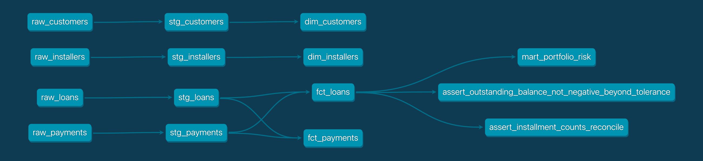

# climate-financing-dbt-demo

An end-to-end dbt warehouse for a climate-hardware installment lender
(solar, battery, heat pump and EV-charger financing): raw data → staging →
a dimensional star schema → a risk mart that a Risk or Finance team would
query directly. **40 data tests, all passing.**



*Lineage graph from `dbt docs generate`: four raw sources, one staging model
each, dimensions and facts, the portfolio-risk mart, and two custom tests on
`fct_loans`.*

## Model layers

| Layer | Models | What it does |
| --- | --- | --- |
| **Raw** (`seeds/`) | `raw_customers`, `raw_installers`, `raw_loans`, `raw_payments` | Source data as it lands. Tested for keys and accepted values at the point of entry. |
| **Staging** (`models/staging/`) | `stg_customers`, `stg_installers`, `stg_loans`, `stg_payments` | One model per source: renaming, type casting, null handling and derived flags (e.g. `is_delinquent_event`). No joins, no business logic. |
| **Dimensions** (`models/marts/`) | `dim_customers`, `dim_installers` | Conformed descriptive entities: who borrowed, who installed. |
| **Facts** (`models/marts/`) | `fct_loans` (grain: one loan), `fct_payments` (grain: one scheduled installment) | Measurable events. `fct_loans` rolls up payment history into installment counts, total paid, outstanding balance and a default flag. |
| **Mart** (`models/marts/`) | `mart_portfolio_risk` | Default and delinquency rates by risk segment and hardware type. The business-facing output. |

## Testing

`dbt test` runs 40 tests:

- **Generic tests** in `schema.yml`: `not_null` and `unique` on keys across
  the raw, staging and mart layers, plus `relationships` (every loan points
  to a real customer and installer, every payment to a real loan) and
  `accepted_values` (risk segments, payment statuses, hardware types) where
  the raw data lands.
- **Two custom SQL tests** in `tests/` that check business rules rather than
  schema rules:
  - `assert_installment_counts_reconcile`: paid + late + missed + upcoming
    installments must add up to the scheduled count for every loan.
  - `assert_outstanding_balance_not_negative_beyond_tolerance`: no loan can
    be overpaid beyond a small rounding tolerance.

## What the risk mart shows

The data is synthetic (see below) and was generated with a built-in risk
gradient, so the mart has a real signal to find. A loan counts as defaulted
once it has two or more missed installments.

| Risk segment | Loans | Default rate |
| --- | ---: | ---: |
| low | 196 | 0.51% |
| medium | 124 | 1.61% |
| high | 48 | 12.50% |

## Stack

- **dbt-core** + **dbt-duckdb**. DuckDB is an in-process warehouse, so this
  runs locally with no cloud account, credentials or cost. The models are
  plain SQL; moving to Snowflake or BigQuery means swapping the adapter in
  `profiles.yml`.
- Raw data is loaded with `dbt seed` because the project is self-contained.

**Data note:** all data is synthetic. `generate_data.py` produces realistic
but fabricated customers, installers, loans and payments. No real company or
customer data is used.

## How to run it

```bash
python3 -m venv .venv && source .venv/bin/activate
pip install -r requirements.txt
python3 generate_data.py          # (re)generates the seed CSVs
export DBT_PROFILES_DIR="$(pwd)"
dbt build                         # seeds, models and all 40 tests
dbt docs generate && dbt docs serve   # browsable lineage graph + column docs
```

## A bug worth writing down

`dbt-duckdb` infers seed column types from the CSV. A mostly-date column with
some blank cells lands as a native `DATE` with the blanks already `NULL`, not
as `VARCHAR`. The staging models were first written for a `VARCHAR` source
(`nullif(paid_date, '')`), which is how most warehouses land raw data. Against
a `DATE` column, `nullif(date_col, '')` makes DuckDB cast `''` to `DATE` for
the comparison, and that throws (`invalid date field format: ""`).

The fix was to cast to `varchar` first (`nullif(cast(paid_date as varchar),
'')`), so the empty-string check works whatever type the source column
arrives as. It's the more portable fix, and it would survive a move to a
cloud warehouse.
